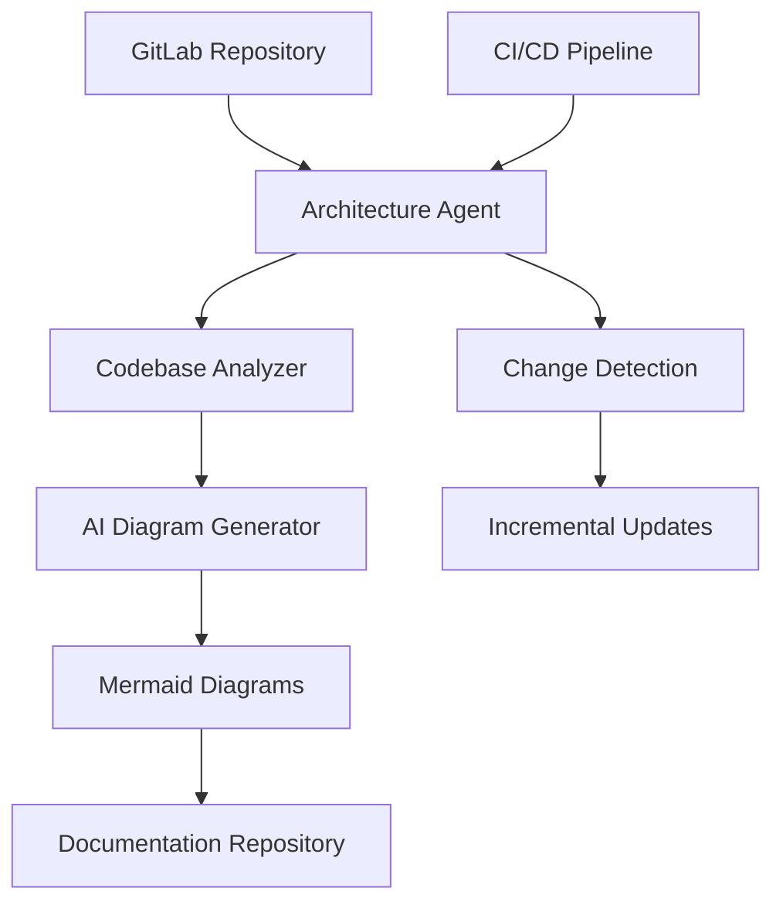

# Enterprise Architecture Diagram Agent

[](https://github.com/navinyashende/enterprise-architecture-diagram-agent/actions)
[](https://sonarcloud.io/dashboard?id=enterprise-arch-agent)
[](https://sonarcloud.io/dashboard?id=enterprise-arch-agent)

An AI-powered agent that automatically generates and maintains enterprise architecture diagrams from codebase analysis using Quarkus, Langchain4j, and Gemini AI.

## 🚀 Features

- **Intelligent Codebase Analysis**: Automatically analyzes Java, Python, JavaScript, and other codebases to understand architecture patterns
- **AI-Powered Diagram Generation**: Uses Google Gemini AI to generate comprehensive Mermaid architecture diagrams
- **Real-time Change Detection**: Monitors codebase changes and updates diagrams automatically
- **GitLab Integration**: Seamlessly integrates with GitLab repositories and CI/CD pipelines
- **Multiple Diagram Types**: Supports component diagrams, sequence diagrams, deployment diagrams, and more
- **Enterprise-Grade**: Built with Quarkus for cloud-native deployment and scalability

## 🏗️ Architecture Overview



## 🛠️ Technology Stack

- **Framework**: Quarkus 3.6+ (Java 21)
- **AI Integration**: Langchain4j with Google Gemini
- **Code Analysis**: JavaParser, TreeSitter, AST analysis
- **Diagram Generation**: Mermaid.js
- **Version Control**: GitLab API v4
- **Containerization**: Docker & Kubernetes
- **Monitoring**: Micrometer, Prometheus
- **Testing**: JUnit 5, Testcontainers

## 📋 Prerequisites

- Java 21+
- Maven 3.9+
- Docker (for containerized deployment)
- GitLab account with API access
- Google Cloud account with Gemini API access

## 🚀 Quick Start

### 1. Clone the Repository

```bash
git clone https://github.com/navinyashende/enterprise-architecture-diagram-agent.git
cd enterprise-architecture-diagram-agent
```

### 2. Configure Environment

```bash
cp src/main/resources/application-example.yml src/main/resources/application.yml
# Edit application.yml with your API keys and configuration
```

### 3. Run in Development Mode

```bash
./mvnw quarkus:dev
```

### 4. Access the Application

- Application: http://localhost:8080
- Health Check: http://localhost:8080/q/health
- Metrics: http://localhost:8080/q/metrics
- OpenAPI: http://localhost:8080/q/swagger-ui

## 📖 Documentation

- [Installation Guide](docs/installation.md)
- [Configuration Reference](docs/configuration.md)
- [API Documentation](docs/api.md)
- [Architecture Guide](docs/architecture.md)
- [Deployment Guide](docs/deployment.md)
- [Contributing Guidelines](docs/contributing.md)

## 🔧 Configuration

### Environment Variables

```bash
# GitLab Configuration
GITLAB_URL=https://gitlab.com
GITLAB_TOKEN=your-gitlab-token

# AI Configuration
GEMINI_API_KEY=your-gemini-api-key
GEMINI_MODEL=gemini-pro

# Application Configuration
QUARKUS_HTTP_PORT=8080
QUARKUS_LOG_LEVEL=INFO
```

### Application Configuration

See [application.yml](src/main/resources/application.yml) for detailed configuration options.

## 🐳 Docker Deployment

### Build Docker Image

```bash
./mvnw clean package
docker build -f src/main/docker/Dockerfile.jvm -t enterprise-arch-agent .
```

### Run with Docker Compose

```bash
docker-compose up -d
```

## ☸️ Kubernetes Deployment

```bash
kubectl apply -f k8s/
```

## 📊 Monitoring

The application includes comprehensive monitoring:

- **Health Checks**: Liveness and readiness probes
- **Metrics**: Application and business metrics via Micrometer
- **Logging**: Structured logging with correlation IDs
- **Tracing**: Distributed tracing support

## 🧪 Testing

```bash
# Run unit tests
./mvnw test

# Run integration tests
./mvnw verify

# Run with coverage
./mvnw clean test jacoco:report
```

## 🤝 Contributing

We welcome contributions! Please see our [Contributing Guidelines](docs/contributing.md) for details.

## 📄 License

This project is licensed under the MIT License - see the [LICENSE](LICENSE) file for details.

## 🆘 Support

- [Issues](https://github.com/navinyashende/enterprise-architecture-diagram-agent/issues)
- [Discussions](https://github.com/navinyashende/enterprise-architecture-diagram-agent/discussions)
- [Wiki](https://github.com/navinyashende/enterprise-architecture-diagram-agent/wiki)

## 🗺️ Roadmap

- [ ] Support for additional programming languages
- [ ] Integration with other version control systems (GitHub, Bitbucket)
- [ ] Advanced diagram customization options
- [ ] Machine learning-based pattern recognition
- [ ] Real-time collaborative diagram editing
- [ ] Integration with enterprise architecture tools