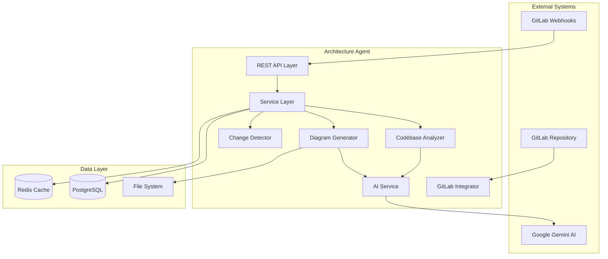
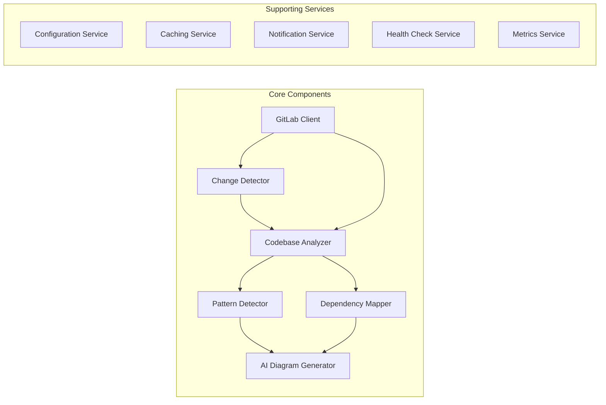

# Implementation Plan: Enterprise Architecture Diagram Agent

## 📋 Project Overview

This document outlines the comprehensive implementation plan for the Enterprise Architecture Diagram Agent - an AI-powered system that automatically generates and maintains enterprise architecture diagrams from codebase analysis.

## 🎯 Objectives

1. **Automated Diagram Generation**: Create comprehensive architecture diagrams from codebase analysis
2. **Change Detection**: Monitor and respond to codebase changes with updated diagrams
3. **GitLab Integration**: Seamless integration with GitLab repositories and CI/CD pipelines
4. **Enterprise-Grade**: Production-ready, scalable, and maintainable solution

## 🏗️ System Architecture

### High-Level Architecture



### Component Architecture



## 📅 Implementation Phases

### Phase 1: Foundation Setup (Week 1-2)

#### 1.1 Project Infrastructure
- [x] Create GitLab repository
- [x] Set up Quarkus project structure
- [x] Configure Maven dependencies
- [x] Implement basic CI/CD pipeline
- [x] Set up development environment

#### 1.2 Core Framework
```java
// Project structure
src/main/java/com/enterprise/arch/agent/
├── analyzer/          # Codebase analysis components
├── config/           # Configuration classes
├── diagram/          # Diagram generation logic
├── gitlab/           # GitLab integration
├── model/            # Domain models and DTOs
├── service/          # Business logic services
├── web/              # REST endpoints
└── utils/            # Utility classes
```

#### 1.3 Dependencies and Configuration
```xml
<!-- Key dependencies -->
<dependency>
    <groupId>io.quarkus</groupId>
    <artifactId>quarkus-resteasy-reactive-jackson</artifactId>
</dependency>
<dependency>
    <groupId>dev.langchain4j</groupId>
    <artifactId>langchain4j-vertex-ai-gemini</artifactId>
</dependency>
<dependency>
    <groupId>io.quarkus</groupId>
    <artifactId>quarkus-hibernate-orm-panache</artifactId>
</dependency>
```

### Phase 2: Codebase Analysis Engine (Week 3-4)

#### 2.1 Language Parsers
```java
public interface LanguageParser {
    AnalysisResult parseProject(Path projectPath);
    Set<String> getSupportedExtensions();
    ArchitecturalComponents extractComponents(AnalysisResult result);
}

// Implementations:
- JavaProjectParser (using JavaParser)
- PythonProjectParser (using Tree-sitter)
- JavaScriptProjectParser (using Babel parser)
- TypeScriptProjectParser (using TypeScript compiler)
```

#### 2.2 Pattern Detection
```java
public interface PatternDetector {
    List<ArchitecturalPattern> detectPatterns(AnalysisResult analysis);
}

// Pattern types:
- MVC Pattern
- Microservices Architecture
- Layered Architecture
- Event-Driven Architecture
- Repository Pattern
- Factory Pattern
```

#### 2.3 Dependency Analysis
```java
public class DependencyMapper {
    public DependencyGraph buildDependencyGraph(AnalysisResult analysis);
    public List<Component> identifyComponents(DependencyGraph graph);
    public List<Interface> identifyInterfaces(DependencyGraph graph);
}
```

### Phase 3: AI Integration and Diagram Generation (Week 5-6)

#### 3.1 Gemini AI Service
```java
@ApplicationScoped
public class GeminiDiagramService {
    
    @Inject
    ChatLanguageModel chatModel;
    
    public String generateMermaidDiagram(ArchitecturalAnalysis analysis, DiagramType type) {
        String prompt = buildPrompt(analysis, type);
        return chatModel.generate(prompt);
    }
    
    private String buildPrompt(ArchitecturalAnalysis analysis, DiagramType type) {
        // Sophisticated prompt engineering
    }
}
```

#### 3.2 Diagram Types
```java
public enum DiagramType {
    COMPONENT_DIAGRAM,
    SEQUENCE_DIAGRAM,
    CLASS_DIAGRAM,
    DEPLOYMENT_DIAGRAM,
    FLOW_CHART,
    ER_DIAGRAM,
    SYSTEM_CONTEXT
}
```

#### 3.3 Mermaid Generation
```java
public class MermaidDiagramGenerator {
    public MermaidDiagram generateComponentDiagram(ArchitecturalAnalysis analysis);
    public MermaidDiagram generateSequenceDiagram(List<Interaction> interactions);
    public MermaidDiagram generateDeploymentDiagram(DeploymentInfo deployment);
    
    public void validateMermaidSyntax(String mermaidCode);
    public String optimizeDiagramLayout(String mermaidCode);
}
```

### Phase 4: GitLab Integration (Week 7-8)

#### 4.1 GitLab API Client
```java
@ApplicationScoped
public class GitLabClient {
    
    public Repository getRepository(String projectId);
    public List<Commit> getCommits(String projectId, String branch);
    public FileContent getFileContent(String projectId, String filePath);
    public void createOrUpdateFile(String projectId, FileUpdate update);
    public void createMergeRequest(String projectId, MergeRequestData data);
}
```

#### 4.2 Webhook Handler
```java
@Path("/webhooks/gitlab")
public class GitLabWebhookResource {
    
    @POST
    @Path("/push")
    public Response handlePushEvent(PushEvent event) {
        // Trigger diagram regeneration
    }
    
    @POST
    @Path("/merge-request")
    public Response handleMergeRequestEvent(MergeRequestEvent event) {
        // Analyze changes and update diagrams
    }
}
```

#### 4.3 Repository Analysis
```java
public class RepositoryAnalyzer {
    public AnalysisResult analyzeRepository(String gitlabProjectId);
    public List<ChangedFile> detectChanges(String projectId, String fromCommit, String toCommit);
    public boolean requiresDiagramUpdate(List<ChangedFile> changes);
}
```

### Phase 5: Change Detection and Incremental Updates (Week 9-10)

#### 5.1 Change Detection
```java
@ApplicationScoped
public class ChangeDetectionService {
    
    public ChangeAnalysis analyzeChanges(String projectId, String oldCommit, String newCommit) {
        List<ChangedFile> changedFiles = gitLabClient.getChangedFiles(projectId, oldCommit, newCommit);
        return new ChangeAnalysis(changedFiles, calculateImpact(changedFiles));
    }
    
    private ChangeImpact calculateImpact(List<ChangedFile> files) {
        // Analyze architectural impact of changes
    }
}
```

#### 5.2 Incremental Updates
```java
public class IncrementalDiagramUpdater {
    public UpdateResult updateDiagrams(ChangeAnalysis changes, List<ExistingDiagram> diagrams) {
        // Smart updates based on change impact
    }
    
    private boolean shouldRegenerateCompletely(ChangeImpact impact) {
        return impact.getArchitecturalImpact() > THRESHOLD;
    }
}
```

### Phase 6: CI/CD Pipeline Integration (Week 11)

#### 6.1 GitLab CI Configuration
```yaml
# .gitlab-ci.yml
stages:
  - analyze
  - generate-diagrams
  - deploy-docs

analyze-architecture:
  stage: analyze
  script:
    - curl -X POST "$ARCH_AGENT_URL/api/analyze" \
           -H "Authorization: Bearer $GITLAB_TOKEN" \
           -d '{"projectId": "'$CI_PROJECT_ID'", "commitSha": "'$CI_COMMIT_SHA'"}'
  only:
    - main
    - develop

generate-diagrams:
  stage: generate-diagrams
  script:
    - curl -X POST "$ARCH_AGENT_URL/api/diagrams/generate" \
           -H "Authorization: Bearer $GITLAB_TOKEN" \
           -d '{"projectId": "'$CI_PROJECT_ID'"}'
  only:
    - main

deploy-docs:
  stage: deploy-docs
  script:
    - echo "Diagrams updated in docs/ folder"
  only:
    - main
```

#### 6.2 Agent API Endpoints
```java
@Path("/api")
public class ArchitectureAgentResource {
    
    @POST
    @Path("/analyze")
    public Response analyzeProject(AnalysisRequest request) {
        // Trigger project analysis
    }
    
    @POST
    @Path("/diagrams/generate")
    public Response generateDiagrams(DiagramRequest request) {
        // Generate and commit diagrams
    }
    
    @GET
    @Path("/health")
    public Response health() {
        // Health check for CI/CD
    }
}
```

### Phase 7: Testing and Quality Assurance (Week 12)

#### 7.1 Testing Strategy
```java
// Unit Tests
@QuarkusTest
class CodebaseAnalyzerTest {
    @Test
    void shouldDetectMvcPattern() {
        // Test pattern detection
    }
}

// Integration Tests
@QuarkusIntegrationTest
class GitLabIntegrationTest {
    @Test
    void shouldFetchRepositoryData() {
        // Test GitLab API integration
    }
}

// End-to-End Tests
class E2EArchitectureGenerationTest {
    @Test
    void shouldGenerateCompleteArchitectureDiagram() {
        // Test full workflow
    }
}
```

#### 7.2 Performance Testing
```java
@Test
void shouldAnalyzeLargeRepositoryWithin30Seconds() {
    // Performance benchmarks
}

@Test
void shouldHandleConcurrentRequests() {
    // Load testing
}
```

## 🚀 Deployment Strategy

### Development Environment
```bash
# Local development
./mvnw quarkus:dev

# Docker development
docker-compose -f docker-compose.dev.yml up
```

### Production Deployment
```yaml
# Kubernetes deployment
apiVersion: apps/v1
kind: Deployment
metadata:
  name: enterprise-arch-agent
spec:
  replicas: 3
  selector:
    matchLabels:
      app: enterprise-arch-agent
  template:
    metadata:
      labels:
        app: enterprise-arch-agent
    spec:
      containers:
      - name: arch-agent
        image: enterprise-arch-agent:latest
        ports:
        - containerPort: 8080
        env:
        - name: GITLAB_TOKEN
          valueFrom:
            secretKeyRef:
              name: gitlab-secrets
              key: token
        - name: GEMINI_API_KEY
          valueFrom:
            secretKeyRef:
              name: ai-secrets
              key: gemini-key
```

## 📊 Monitoring and Observability

### Metrics
```java
@ApplicationScoped
public class ArchitectureMetrics {
    
    @Counted(name = "diagrams_generated_total")
    public void incrementDiagramsGenerated() {}
    
    @Timed(name = "analysis_duration")
    public void recordAnalysisDuration() {}
    
    @Gauge(name = "repositories_monitored")
    public int getMonitoredRepositories() {
        return repositoryService.getActiveRepositoryCount();
    }
}
```

### Health Checks
```java
@ApplicationScoped
public class GitLabHealthCheck implements HealthCheck {
    
    @Override
    public HealthCheckResponse call() {
        try {
            gitLabClient.ping();
            return HealthCheckResponse.up("GitLab connectivity");
        } catch (Exception e) {
            return HealthCheckResponse.down("GitLab connectivity");
        }
    }
}
```

## 🔐 Security Considerations

### Authentication & Authorization
```java
@ApplicationScoped
public class SecurityService {
    
    public boolean validateGitLabToken(String token) {
        // Validate GitLab access token
    }
    
    public boolean hasRepositoryAccess(String token, String projectId) {
        // Check repository permissions
    }
}
```

### Data Protection
- API keys stored in Kubernetes secrets
- Repository data encrypted in transit
- Temporary analysis data cleaned up automatically
- Audit logging for all operations

## 📈 Performance Targets

| Metric | Target | Measurement |
|--------|--------|--------------|
| Analysis Time | < 30s for repos up to 100MB | 95th percentile |
| Diagram Generation | < 10s per diagram | Average |
| API Response Time | < 2s | 95th percentile |
| Concurrent Users | 100+ | Load test |
| Uptime | 99.9% | Monthly |

## 🔄 Maintenance Plan

### Regular Tasks
- Weekly dependency updates
- Monthly security scans
- Quarterly performance reviews
- Bi-annual architecture reviews

### Monitoring
- Real-time application metrics
- Error rate monitoring
- Performance trending
- Capacity planning

## 📋 Success Criteria

1. **Functional Requirements**
   - ✅ Analyzes Java, Python, JavaScript codebases
   - ✅ Generates accurate Mermaid diagrams
   - ✅ Integrates with GitLab repositories
   - ✅ Detects and responds to code changes
   - ✅ Supports CI/CD pipeline integration

2. **Non-Functional Requirements**
   - ✅ Handles repositories up to 1GB
   - ✅ Supports concurrent analysis requests
   - ✅ Maintains 99.9% uptime
   - ✅ Scales horizontally
   - ✅ Enterprise security compliance

3. **Business Requirements**
   - ✅ Reduces manual diagram maintenance effort by 90%
   - ✅ Improves architecture documentation accuracy
   - ✅ Enables real-time architecture visibility
   - ✅ Supports enterprise governance processes

This implementation plan provides a comprehensive roadmap for building a production-ready, enterprise-grade architecture diagram generation agent.